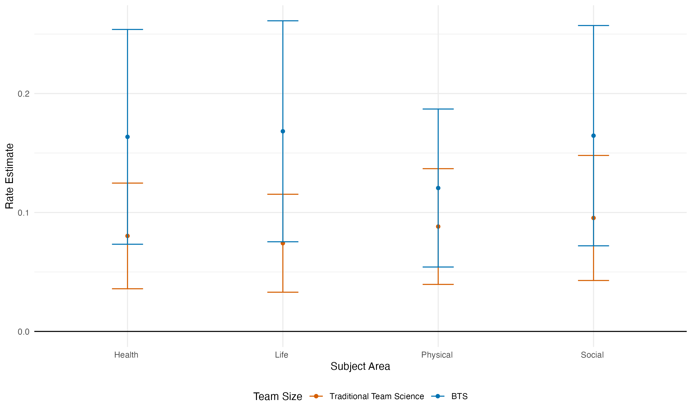

# Supplemental Material

We have included several supplemental tables and figures for visualization of results discussed in the manuscript. 

```{r rate-estimates-fig, include = TRUE, fig.cap = "Exponential growth rate estimates with 95% confidence intervals.", out.width='100%'}

```

```{r fig-map-both, include = TRUE, fig.cap="Geopolitical regions represented in big-team science publications versus all publications. The mosaic plot is grouped by UN subregion with the largest number of publications starting on the bottom left and smallest on the top right. Therefore, North America represents the largest number of authors within BTS (i.e., bottom right, then separated into the geopolitical areas within that subregion), followed by Eastern Europe (top left), and so on.", out.width='100%'}
knitr::include_graphics("figure/figure_6_map.png")
```

```{r fig-effect-gpe, include = TRUE, fig.cap = "Effect size of the differences in representation for UN Regions for author affiliations in big-team science papers by year. Larger dots indicate more papers and authors represented in the calculation of effect size.", out.width='100%'}
knitr::include_graphics("figure/figure_8_author_effect_gpe.png")
```

```{r big-teams-table, results = 'asis'}
big_teams_papers <- 968765
big_teams_authors <- 4541369

apa_table(DF$paper_stats %>% 
        arrange(Statistic), 
        caption = "Number of Authors and Papers by Subject Area",
        note = "Papers can be classified into multiple categories.", 
        align = c("l", rep("c", 5)), 
        digits = 0)
```

