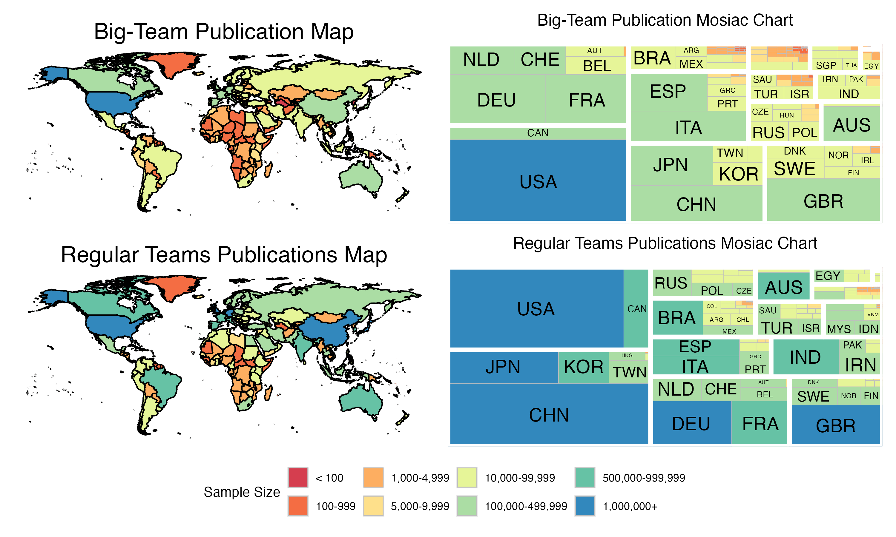
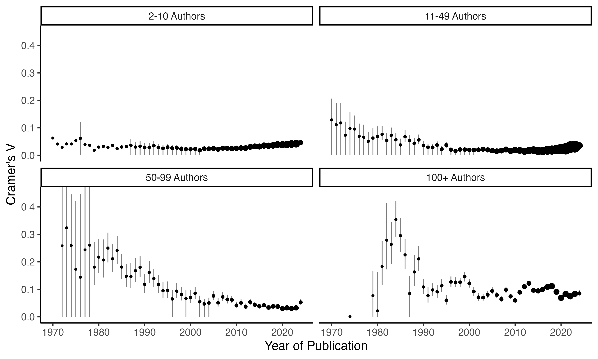

```{r setup, include = FALSE}
knitr::opts_knit$set(echo = FALSE, warning = FALSE, message = FALSE, include = FALSE, error = FALSE)
library(papaja)
library(knitr)
library(ggplot2)
library(treemapify)
library(countrycode)
library(rio)
library(maps)
library(dplyr)
library(tidyr)
library(MOTE)
library(MBESS)
library(patchwork)
library(ggplot2)
library(ggwordcloud)
library(figpatch)
library(RColorBrewer)
library(latex2exp)
library(broom)
library(minpack.lm)

options(scipen = 99)

strip_labels <- expression(
  "M Coefficient " = b[M],
  "Coefficient" = b,
  "SD Coefficient" = b[SD],
  "Effect Size" = R^2
)

strip_labels <- c(
  "M Coefficient" = "b[M]",
  "SD Coefficient" = "b[SD]",
  "Effect Size" = "R^2",
  "Coefficient" = "b"
)

label_expressions <- function(values) {
  stopifnot(is.expression(values))
  as_labeller(function(x) {
    if (is.null(names(values))) {
      x <- seq_along(x)
      if (length(x)!=length(values)) warning(paste0("Number of labels(", 
        length(values), ") does not match number of values (", length(x), ")"))
    }
    as.list(values[x])
  }, default = identity)
}

# things to import
var_list <- c("author_stats", "paper_stats", "author_paper_year",
              "career_time", "lm_coefficients", "geo_country",
              "effect_size_gp")

var_list_import <- paste0("data/scopus_outputs_2/", var_list, ".xlsx")

DF <- lapply(var_list_import, import)
names(DF) <- var_list
```

Scientific discovery has increasingly become a collaborative process,
with the scale and scope of team science have dramatically expanded in
recent years [@council2015]. Collaboration in scientific endeavors
involves multiple researchers (potentiality) at multiple institutions to
communicate and work together to advance knowledge in their chosen
field(s). This unique composition of a collaboration for each project is 
dependent on the skill sets, hypotheses, and perspectives of collaborators 
involved. A key strength of collaboration lies in its flexibility, allowing it 
to adapt to the needs of the project and the researchers themselves. 

While collaboration is not new in science, interest in "team science" is
growing as individual researchers seek an interdisciplinary approach to
research or bring on more students to their project. Team science is
often defined as groups of researchers with various expertise working
together to investigate complex problems [@fiore2008]. Unlike general
collaboration, team science involves structured roles, coordinated
workflows, and shared resources to address challenges that would be
difficult for individual researchers or one small team to solve
independently.

The movement toward team science reflects demands of modern research to
answer complex questions, meet funding agencies and universities desires for
interdisciplinary research, and the desire to increase scientific representation
[@council2015]. Further, the evolution of team science reflects broader shifts
in research practices, driven by two sources: 1) increasing globalization 
and technology that allows for real-time interdisciplinary research [
@jones2008], and 2) expanding interest in reproducibility, replication, 
and generalizability [i.e., the credibility movement, @maxwell2015; @nelson2018; 
@zwaan2018; @vazire2022]. Technological advances have provided easier ways to
collaborate with people who are from other universities and countries
through document sharing platforms (e.g., Google, GitHub, and the Open
Science Framework), video chatting platforms (e.g., Zoom, Microsoft
Teams), and messaging and project management platforms (e.g., Slack,
Trello, when2meet, etc.).

The credibility movement has been the main catalyst for the increased
interest and broader shift of research practices. The movement
emphasizes reproducibility and transparency in science, encouraging
researchers to form new ways to increase the rigor in scientific
endeavors. Throughout the last decade, the credibility movement has
pushed for larger, more diverse teams and the involvement of
participants from varied backgrounds. This shift in teams and
participants focuses on increasing credibility, generalizability, and
reliability of scientific findings. This form of collaboration has been
coined "Big Team Science." Big Team Science (BTS) builds on team science
by scaling efforts to include larger, often globally diverse teams,
which requires significant coordination and infrastructure [@coles2022;
@forscher2022a; @stewart2017]. BTS projects and organizations organize
extensive collaborations, intentionally incorporating diverse
populations and perspectives into research. This large-scale approach
enhances the reliability and generalizability of findings by integrating
varied methodologies and viewpoints, leading to more robust and
inclusive scientific outcomes. BTS organizations often pool extensive
networks of researchers and resources, aiming to tackle grand scientific
challenges that would be difficult to address within smaller or less
coordinated collaborations. By having both collaborations that span
across the globe and subfields of research areas, age groups, and
education levels should help to drive science in the path of better
materials, reliability, generalizability, and more robust sample sizes
in a study [@auspurg2021; @nosek2014method; @lebel2018].

For example, psychology has seen an increase in BTS publications like
the Open Science Collaboration [@opensciencecollaboration2015], Many
Labs Collaborations [@buttrick2020; @ebersole2016; @ebersole2020;
@klein2018; @klein2022; @mathur2020; @skorb2020] or the first papers
from the Psychological Science Accelerator [@bago2022; @buchanan2023;
@dorison2022; @jones2021;
@psychologicalscienceacceleratorself-determinationtheorycollaboration2022;
@moshontz2018; @wang2021]. The success and interest in the large-scale
reproducibility projects [@opensciencecollaboration2015;
@10.7554/eLife.71601], paired with the meta-scientific publications
focusing on researcher practices and incentive structures
[@silberzahn2018many; @john2012] led to a change in journal guidelines
and incentives for researchers interested in participating in
large-scale studies overall [@grahe2014; @kidwell2016; @nosek2015;
@mayo-wilson2021]. In some fields, the BTS movement demonstrated that
large-scale teams were a practical (and publishable) solution to
answering research questions in generalizable way. The support for
Registered Reports, papers accepted before the data has been collected
[@nosek2014; @stewart2020], has allowed researchers to invest in
projects that they know should be published when the project is
complete. Further, the implementation of the Transparency and Openness
Guidelines [@nosek2015] and the Contributor Role Taxonomy (CRediT)
system [@allen2019] have pushed journals and researchers to promote more
open, inclusive publication practices.

Beyond replication concerns, the credibility movement has mirrored calls
for diversification or de-WEIRDing (e.g., Western, Educated,
Industrialized, Rich, and Democratic) scientific research [@henrich2010;
@newson2021; @rad2018] by improving representation in research samples.
Like the large-scale studies in Physics [@aphilos2021; @castelnovo2018]
and Biology [@collins2003], the Social Sciences struggle to represent
the breadth of humanity across both researcher and population
characteristics. Now, grassroots organizations, such as the
Psychological Science Accelerator [@moshontz2018], ManyBabies
(<https://manybabies.github.io/>), NutNet (<https://nutnet.org/>),
DRAGNet (<https://dragnetglobal.weebly.com/>), and IceCube
(<https://icecube.wisc.edu/>) can begin to tackle these issues by
recruiting research labs from all over the globe to provide diversity in
geographic, linguistic, and researcher representation. Publications have
examined the global understanding of morality, face processing, COVID-19
information signaling, and more [@bago2022; @dorison2022; @jones2021;
@psychologicalscienceacceleratorself-determinationtheorycollaboration2022;
@vanbavel2022; @wang2021]. While these organizations and one-time groups
for BTS studies have provided an incredible wealth of data for the
scientific community, we do not yet know exactly how to define BTS -
which is generally termed "an unusually large number of collaborators"
[@forscher2022a; @coles2022].

The lack of formal definition raises questions about whether it
represents a distinct phenomenon or simply a natural extension of team
science. These big teams pose unique challenges, including coordinating
work across diverse time zones, managing conflicts in decision-making,
and ensuring fair distribution of credit for contributions
[@cummings2007; @wuchty2007], but also could provide big rewards by
pooling expertise and increased interdisciplinary funding [@fiore2008].
This paper seeks to clarify the concept of BTS by first establishing a
data-driven definition based on publication patterns. With this
quantitative distinction in place, we analyze publication trends over
time to assess the trajectories of both traditional team science and
BTS. Furthermore, we investigate the diversity of authors involved in
these collaborations to explore whether shifts in the scientific
landscape, such as efforts to de-WEIRD science and the expansion of
collaborative opportunities, have influenced who participates in team
science and BTS. By synthesizing insights from the growth and
diversification of team science, this paper seeks to critically examine
the emergence of big teams. Specifically, it aims to explore whether big
teams are quantitatively different from traditional collaboration models
with the following research questions.

# Research Questions

-   Research Question 1: Exploring historical and current publication
    values, what should define big team science versus team science?
    -   Question 1A: What number of authors and institutional
        affiliations should designate the differences between team
        science and big team science?
    -   Question 1B: Using the definition from 1A, are there changes in
        the number of publications over time?
-   Research Question 2: How has the diversity of those involved in team
    science and big team science changed over time?

# Method

## Publications

We used data from 1970-2024 in the Scopus database, as it is noted
online that 1970 and forward includes cited references for calculation
of several of our variables described below. We analyzed our results
based on four subject areas present in the Scopus database: Physical
Sciences, Health Sciences, Social Sciences, and Life Sciences. We used
the subject area split to ensure one field did not dominate BTS
definitions and determine differences in trends across sub-areas of
science. We filtered the database to include articles, articles in
press, business articles, conference papers, data papers, preprints, and
surveys using Elsevier's classification system. This project was
supported by access to the Scopus database through the International
Center for the Study of Research.

## Data Curation

### RQ1: Defining BTS

For each of the publications in Scopus, we calculated the number of
distinct authors and institutions. If an author had multiple
affiliations, we used the first affiliation listed. Each publication was
classified into the four subject areas based on the All Journal Subject
Codes present in the database. Publications can be included in multiple
subject codes. For example, a medical paper may be listed in both life
sciences and health sciences.

### RQ2: Seniority

Career length for each author was defined as the year of the first
publication minus the current year listed for each author. Number of
publications included the number of unique entries an author was
included in the database. Career length and number of publications was
used as a proxy for the "age" or "seniority" of a scholar.

### RQ2: Geopolitical Region

Geopolitical region was created by binning country code identifiers into
the 17 identified United Nation subregions.

# Results

We used the 95% confidence interval to make decisions on predictor or
effect size differences from zero. The confidence interval that does not
include zero would be considered different from zero (to four decimal
places). We made no directional predictions.

## RQ1A: Defining BTS

```{r total-papers}
total_papers <- 97532104 # the entire database
total_papers_past1970 <- 62966549 # past 1970, in our article types
distinct_authors_past1970 <- 53622443 # all authors 

# one row per author per paper with all authors with at least two  
team_author_aff_combo <- 196835398
team_author_aff_papers <- 32454393
team_author_aff_author <- 28353445

team_author_aff_subject_noNA <- 241269297
team_author_aff_papers_noNA <- 32448373
team_author_aff_author_noNA <- 28350468
```

The total number of papers included in the Scopus database at the time
of this analysis was `r total_papers`. `r total_papers_past1970`
articles were included past 1970 in the defined article types, which
included `r distinct_authors_past1970` distinct authors. We then
filtered the data to include only teams, which was defined as two
authors from at least two institutions. The total number of papers for
team projects was `r team_author_aff_papers` and
`r team_author_aff_author` distinct authors. The data was then
classified into subject areas by paper, which lead to missing data. The
final number of papers included was `r team_author_aff_papers_noNA` with
`r team_author_aff_author_noNA` distinct authors. The dataset was
curated to include one row per author, paper, and subject area (i.e.,
long format [@wickham2007]) which included
`r team_author_aff_subject_noNA` total rows of data.

```{r fig-stats-authors, include = TRUE, fig.cap="The left panel depicts the number of authors included on a paper by subject area, and the right panel demonstrates the number of affiliations by subject area. The boxplot shows the median (bold line), the interquartile range (the box), and the minimum to the 90th percentile of the number of authors/affiliations as the range line. Normally these plots include the entire range of the data, but these extreme range made the boxplot information unreadable. The dots indicate the average number of authors/affiliations for each area with the size of the dot indicating the standard deviation of the statistic. Therefore, larger dots indicate more variability in the number of authors and affiliations.", fig.width = 10, fig.height = 6}
temp_graph <- DF$author_stats %>% 
  filter(SubjectArea != "Multidisciplinary")

auth_plot <- 
  ggplot(temp_graph, aes(x = SubjectArea)) + 
  geom_boxplot(
    aes(
      ymin = Min_Num_Authors,
      lower = lower_IQR,
      middle = Med_Num_Authors,
      upper = upper_IQR,
      ymax = very_high_90
    ),
    stat = "identity"
  ) + 
  theme_bw() + 
  xlab("Subject Area") + 
  ylab("Number of Authors") +
  coord_cartesian(ylim = c(0,12)) + 
  scale_y_continuous(breaks = c(0,2,4,6,8,10,12)) +
  geom_point(aes(x = SubjectArea, y = Average_Num_Authors, 
                 size = SD_Num_Authors)) +
  theme(legend.position = "none")

aff_plot <- 
  ggplot(temp_graph, aes(x = SubjectArea)) + 
  geom_boxplot(
    aes(
      ymin = Min_Num_Aff,
      lower = lower_IQR_Aff,
      middle = Med_Num_Aff,
      upper = upper_IQR_Aff,
      ymax = very_high_90_Aff
    ),
    stat = "identity"
  ) + 
  theme_bw() + 
  xlab("Subject Area") + 
  ylab("Number of First Affiliations") +
  coord_cartesian(ylim = c(0,12)) + 
  scale_y_continuous(breaks = c(0,2,4,6,8,10,12)) +
  geom_point(aes(x = SubjectArea, y = Average_Num_Aff, 
               size = SD_Num_Authors)) +
  theme(legend.position = "none")


auth_plot | aff_plot

ggsave(filename = "figure/figure_1_number.png", width = 10, height = 6)
```

Figure \@ref(fig:fig-stats-authors) displays the number of authors and
affiliations by subject area. The figure demonstrates that the median
number of authors is largest for health sciences, followed by life
science, physical sciences, and then social sciences. The general
pattern of team authorship includes about 2-8 authors, from about 2-4
institutions. We used the maximum value (i.e., across all subject areas)
for the 90th percentile as our exploratory definition for big team
papers after examining the results from this analysis. We selected this
percentile to have the high of the distribution, but also to be able to
include enough papers for analysis across time. Therefore, big teams
were defined as 11 authors from at least 6 different institutions.[^1]

[^1]: In a previous version of this manuscript, we defined big teams as
    10 authors from at least 10 institutions based on our own
    experiences working within a research consortium. All definitions
    are likely subjective, but the definition in this manuscript
    represents the top 10% of author and affiliations in a large body of
    papers.

```{r echo = FALSE}
big_teams_papers <- 968765
big_teams_authors <- 4541369
```

Supplemental Table \@ref(tab:big-teams-table) includes the number of
distinct authors and papers for each subject area by overall teams and
big teams using our 90th percentile definition. The total number of
distinct authors for big team papers was `r big_teams_papers` with
`r big_teams_authors` distinct authors. In RQ2, we split the big team
data into small (11-49), medium (50-99), and large big team (100+)
groupings for convenience to display/analyze geopolitical regions. The
table shows the number of authors and papers for those analyses.

## RQ1B: Changes over Time

For analyzing changes across time, we split the data into team science
projects (2-10 authors, 2-5 affiliations) and BTS projects (as defined
above, 11+ authors, 6+ affiliations). The number of papers found in
Scopus across time for each subject area are displayed in Figure
\@ref(fig:fig-paper-time). The visual results indicated that the number
of team science papers was increasing the most in physical sciences for
all manuscripts, followed by life and health sciences, and the last is
social sciences. Examining only BTS projects shows that the rate is also
increasing across time. All teams appear to start increasing in the
1990s, while BTS projects do not start increasing off floor effects
until past 2000. The health and life sciences show the largest increases
across time in big teams with the smallest trend in the social sciences.

```{r fig-paper-time, include = TRUE, fig.cap = "The number of manuscripts across time for all team science papers (left) and big team science papers (right).", fig.width = 10, fig.height = 6}
temp <- DF$author_paper_year %>% 
  filter(SubjectArea != "Multidisciplinary") %>% 
  filter(Year < 2025) %>% 
  mutate(SubjectArea = gsub("Sciences", "", SubjectArea))

p1 <- ggplot(temp %>% 
         filter(team_size == "regular"), 
         aes(x = Year, y = Number_Papers, 
             colour = SubjectArea)) + 
  geom_point() + 
  theme_minimal() + 
  scale_color_discrete(name = "Subject Area") + 
  theme(legend.position = "bottom",
        axis.text.y = element_text(angle = 45, hjust = 1)) + # Angles the y-axis text
  ylab("Number of Papers") + 
  ggtitle("Team Science Projects") +
  theme(legend.title = element_text(size = 15),
    legend.text = element_text(size = 12))

p2 <- ggplot(temp %>% 
         filter(team_size == "big"), 
         aes(x = Year, y = Number_Papers, 
             colour = SubjectArea)) + 
  geom_point() + 
  theme_minimal() + 
  scale_color_discrete(name = "Subject Area") + 
  theme(legend.position = "bottom",
        axis.text.y = element_text(angle = 45, hjust = 1)) + # Angles the y-axis text
  ylab(NULL) +  # Removes the y-axis label
  ggtitle("BTS Projects") + 
  theme(legend.title = element_text(size = 15),
    legend.text = element_text(size = 15))

combined_plot <- p1 + p2 +
  plot_layout(guides = "collect") & # Collect shared legend
  theme(legend.position = "bottom")  # Center the legend at the bottom

combined_plot

ggsave(filename = "figure/figure_2_acrosstime.png", width = 10, height = 6)
```

Using the `minpack.lm` library [@elzhov2023], we calculated the
exponential rate of growth for team science and BTS projects, and these
results are shown in Supplemental Figure \@ref(fig:rate-estimates-fig). All growth rate
confidence intervals excluded zero, indicating an exponential increase
in the number of team papers over time. BTS growth rates were always
higher than their team science counterparts, but the 95% confidence
intervals for the growth estimate overlapped for all statistics.
Therefore, the growth trends, while visually appearing to be different,
were likely similar for each subject area and team size when examined by
estimating exponential growth statistics.

```{r echo = FALSE, include=FALSE}
# Initialize the results list
corr.results <- list()

# Ensure 'group' and 'subjarea' are defined
group <- unique(temp$team_size)
subjarea <- unique(temp$SubjectArea)

# Loop through groups and subject areas
for (group_label in group) {
  for (SA in subjarea) {
    stuff <- temp %>%
      filter(team_size == group_label) %>%
      filter(SubjectArea == SA)
    
    if (nrow(stuff) < 3 || any(stuff$Number_Papers <= 0)) {
      message("Skipping ", group_label, " - ", SA, ": insufficient or invalid data")
      next
    }
    
    # Calculate starting values
    a_start <- mean(stuff$Number_Papers, na.rm = TRUE)
    log_y <- log(stuff$Number_Papers)
    b_start <- coef(lm(log_y ~ stuff$Year))[2]
    
    tryCatch({
      fit <- nlsLM(
        Number_Papers ~ a * exp(b * Year), 
        data = stuff, 
        start = list(a = a_start, b = b_start)
      )
      corr.results[[paste0(group_label, "_", SA)]] <- tidy(fit)
    }, error = function(e) {
      message("Fit failed for ", group_label, " - ", SA, ": ", e$message)
    })
  }
}

corr.DF <- bind_rows(corr.results) %>% 
  mutate(group = rep(group, each = 8)) %>% 
  mutate(SubjectArea = c(
    rep(subjarea, each = 2),
    rep(subjarea, each = 2)
    )) %>% 
  filter(term != "a") %>% 
  mutate(conf.low = estimate-2*std.error,
         conf.high = estimate+2*std.error) %>% 
  mutate(group = factor(group, 
                        levels = c("regular", "big"),
                        labels = c("Team Science", "BTS")))
  

ggplot(corr.DF, aes(x = SubjectArea, y = estimate, color = group)) + 
  geom_point() +
  theme_minimal() + 
  geom_errorbar(aes(ymin = conf.low, ymax = conf.high),
                width = .2) + 
  ylab("Rate Estimate") + 
  xlab("Subject Area") + 
  scale_color_manual(values = c("#D55E00", "#0072B2"), name = "Team Size") + 
  theme(legend.position = "bottom") + 
  geom_hline(yintercept = 0)

ggsave(filename = "figure/figure_3_growth.png", width = 10, height = 6)
```

## RQ2: Seniority

```{r fig-career, include = TRUE,  warning = FALSE, message = FALSE, fig.cap = "Average career length for big-team science authors. Larger dots indicate more variability in career length for authors by averaging the standard deviation in career length for each manuscript within a year. The data has been filtered to at least 10 publications in a year for this graph.", fig.width=10, fig.height=6}
ggplot(DF$career_time %>% 
         filter(SubjectArea != "Multidisciplinary") %>% 
         filter(num_papers >= 10) %>% 
         filter(Year < 2025) %>% 
         mutate(Team = factor(Team, 
                              levels = c("Regular", "Big"),
                              labels = c("Team Science", "BTS"))), 
       aes(Year, avg_career, color = Team)) +
  theme_classic(base_size = 15) + 
  geom_point(aes(size = sd_career)) +
  facet_wrap(~SubjectArea) + 
  theme(legend.position = "bottom") + 
  ylab("Average Career Length") +
  xlab("Year of Publication") + 
  scale_color_manual(values = c("#D55E00", "#0072B2"), name = "Team Size") + # Red and Blue from RdBu ends
  guides(size = "none")
  #scale_size_continuous(name = "Number Papers")

ggsave(filename = "figure/figure_4_career.png", width = 10, height = 6)
```

Figure \@ref(fig:fig-career) portrays the average career length for
authors involved in team science and BTS projects over time. Career
length was defined as the year of first publication minus the current
year, and higher numbers mean longer careers. The general pattern for
team science and BTS projects is a decrease in average career length
over time. However, it appears that, in at least the last two decades,
BTS projects average a longer career length than team science projects.
This trend is visually consistent across all four subject areas
examined.

### Career Length

To analyze these trends over time, we calculated the average career
length for each publication (i.e., averaging author career lengths to
create one score for each paper) and analyzed a regression analysis
using career length to predict year of publication. In order to show
variance between individuals, we calculated the standard deviation of
career length for each publication and used this variance as an
additional predictor. Negative career length slopes would indicate more
young scholars in later years (i.e., lower average career length as time
increases). Positive career length slopes would indicate older scholars
in later years (i.e., higher average career length as time increases).
Negative career variance slopes imply that variability decreases over
the years, so the average career length is more homogeneous. Positive
career length slopes imply that variability increases over the years, so
the average career length is varied across individuals (i.e., different
stages of scholars). Figure \@ref(fig:fig-heatmap) displays the results
for all regression analyses.

```{r lm-coefficients}
sample_size <- 1000000
DF$lm_coefficients$r2_low <- DF$lm_coefficients$r2_high <- NA

# add upper and lower Rsquared values
for (i in 1:nrow(DF$lm_coefficients)){
  temp <- ci.R2(R2 = DF$lm_coefficients$rsquared[i], 1, sample_size)
  DF$lm_coefficients$r2_low[i] <- temp$Lower.Conf.Limit.R2
  DF$lm_coefficients$r2_high[i] <- temp$Upper.Conf.Limit.R2
}

# create upper and lower CIs for each coefficient
DF$lm_coefficients <- DF$lm_coefficients %>% 
  mutate(b_avg_low = b_avg_effect - qt(.025, sample_size, lower.tail = F)*se_avg_effect,
         b_avg_high = b_avg_effect + qt(.025, sample_size, lower.tail = F)*se_avg_effect,
         b_std_low = b_std_effect - qt(.025, sample_size, lower.tail = F)*se_std_effect,
         b_std_high = b_std_effect + qt(.025, sample_size, lower.tail = F)*se_std_effect)

```

```{r fig-heatmap, include = TRUE, fig.cap="Heatmap results of regression analyses for career length, number of publications, and geopoliticalwithin the region. Each square represents a *b* value or the slope of the predictor (x-axis) onto the dependent variable (each panel), with the exception of the bottom row which is the effect size of each regression analysis $R^2$. Slopes included both the overall value of the predictor ($b$, $b_M$) and the standard deviation of the predictor over time ($b_{SD}$). The color of the square represents the strength of the predictor. The top figure represents all results together for comparison across analyses. The bottom row represents individual heatmaps for each hypothesis to distinguish small differences between subject areas for those research questions.", warning = FALSE, message = FALSE, fig.width=10, fig.height=6}

graphDF <- DF$lm_coefficients %>% 
  select(Discipline, b_avg_effect, b_std_effect, type, rsquared, coefficient) %>% 
  pivot_longer(cols = c(b_avg_effect, b_std_effect, rsquared)) %>% 
    left_join(
    DF$lm_coefficients %>% 
  select(Discipline, type, coefficient, r2_high:b_std_high) %>% 
  pivot_longer(cols = c(-Discipline, -type, -coefficient)) %>% 
  mutate(ci_name = ifelse(
    grepl("low", name), "low", "high"
  ),
  name = gsub("r2_low|r2_high", "rsquared", name),
  name = gsub("b_avg_low|b_avg_high", "b_avg_effect", name),
  name = gsub("b_std_low|b_std_high", "b_std_effect", name)),
  by = c("Discipline", "type", "coefficient", "name")
  ) %>% 
  mutate(name = ifelse(
    coefficient == "diversity" & name != "rsquared", "b_effect", name
  )) %>% 
  mutate(name = factor(name, 
                levels = c("b_avg_effect", "b_effect", 
                           "b_std_effect", "rsquared"),
                labels = c("M Coefficient", "Coefficient", 
                           "SD Coefficient", "Effect Size"))) %>%
  rename(Estimate = value.x,
         Regression = coefficient,
         CI = value.y,
         Size = type,
         Coefficient = name) %>% 
  mutate(Discipline = gsub(" Sciences", "", Discipline)) %>% 
  pivot_wider(
    id_cols = c(Discipline, Size, Regression, Coefficient, Estimate),
    names_from = ci_name,
    values_from = CI
  ) %>%
  mutate(heat_label = ifelse(
    low < .00001 & high > .00001, "NS", ""
  )) %>% 
  mutate(Size = factor(Size, 
                       levels = c("big", "regular"),
                       labels = c("BTS", "TS")))

career_heat <- ggplot(graphDF %>% 
                        filter(Regression == "career"), 
       aes(x = Discipline, y = Size, fill = Estimate)) + 
  geom_tile(color = "white") +  
  geom_text(aes(label = format(round(Estimate, 4), digits = 4))) +  
  facet_grid(~ Coefficient, labeller = labeller(Coefficient = as_labeller(strip_labels, label_parsed))) +
  theme_minimal(base_size = 15) +
  scale_fill_distiller(palette = "RdBu", direction = 1) + 
  theme(
    # axis.text.x = element_text(angle = 45, hjust = 1),  # Rotate x-axis labels for readability
    panel.border = element_rect(color = "black", fill = NA, size = 0.5)  # Add borders between facets
  ) + 
  xlab(NULL) +
  ylab("Career Length")

pub_heat <- ggplot(graphDF %>% 
                        filter(Regression == "pub_count"), 
       aes(x = Discipline, y = Size, fill = Estimate)) + 
  geom_tile(color = "white") +  
  geom_text(aes(label = format(round(Estimate, 4), digits = 4))) +  
  facet_grid(~ Coefficient, labeller = labeller(Coefficient = as_labeller(strip_labels, label_parsed))) + 
  theme_minimal(base_size = 15) +
  scale_fill_distiller(palette = "PuOr", direction = 1) + 
  theme(
    # axis.text.x = element_text(angle = 45, hjust = 1),  # Rotate x-axis labels for readability
    panel.border = element_rect(color = "black", fill = NA, size = 0.5)  # Add borders between facets
  ) +
  xlab(NULL) + 
  ylab("Pub Count")

diversity_heat <- ggplot(graphDF %>% 
                        filter(Regression == "diversity") %>% 
                          filter(!is.na(Estimate)) %>% 
                          mutate(Coefficient = droplevels(Coefficient)), 
       aes(x = Discipline, y = Size, fill = Estimate)) + 
  geom_tile(color = "white") +  
  geom_text(aes(label = format(round(Estimate, 4), digits = 4))) +  
  facet_grid(~ Coefficient, labeller = labeller(Coefficient = as_labeller(strip_labels, label_parsed))) +
  theme_minimal(base_size = 15) +
  scale_fill_distiller(palette = "BrBG", direction = 1) + 
  theme(
    # axis.text.x = element_text(angle = 15, hjust = 1),  # Rotate x-axis labels for readability
    panel.border = element_rect(color = "black", fill = NA, size = 0.5)  # Add borders between facets
  ) +
  ylab("Geopolitical Diversity")

career_heat / pub_heat / diversity_heat

ggsave(filename = "figure/figure_5_heatmap.png", width = 12, height = 10, units = "in")
```

As shown in Figure \@ref(fig:fig-heatmap), all estimated slopes were
negative, indicating that author teams are, on average, composed of
younger scholars over time. The slope of the mean career length ($b_M$)
and variability in career length ($b_{SD}$) was consistently negative
across disciplines and team sizes, with all estimates falling outside
the defined null threshold (i.e., $|b| > 0.00001$). Most subject areas
showed significantly different slopes within their respective team size,
as evidenced by non-overlapping 95% confidence intervals for both $b_M$
and $b_{SD}$. The Physical Sciences exhibited the steepest declines in
both average career length and its variability (e.g., $b_M$ = -0.7134,
$b_{SD}$ = -0.2202 for big teams), suggesting a sharp shift toward
younger and more uniformly early-career author teams. In comparison,
life sciences showed a slightly smaller shift toward earlier career
scholars with less variability, followed by health and social sciences.
The only non-significant difference was found between life and social
sciences in big teams for author career variability.

These findings suggest a widespread trend toward younger, less-senior
authorship over time. However, this trend was more pronounced in team
science-sized teams than in BTS teams. In all four subject areas, team
science teams showed steeper declines in both the average and
variability of author career length, as reflected by significantly
different slopes with no overlapping confidence intervals. This finding
indicates that regular teams are more strongly influenced by the
increasing participation of earlier-career researchers, whereas big
teams exhibit the same general trend but to a lesser extent. Effect
sizes were substantial across all models, with $R^2$ values ranging from
.2818 to .4910. The largest effect was observed in the Physical Sciences
for big teams ($R^2$ = .4910), reflecting the strongest association
between author career stage and publication timing. Together, these
results indicate that the shift toward younger, more early-career author
teams is widespread but not uniform across disciplines, and that team
size plays a meaningful role in moderating the strength of these
temporal trends. Full model estimates and confidence intervals are
available on the OSF repository.

### Publication Count

We used the same analyses using number of publications to represent
diversity instead of career length. An increasing slope over time
indicates that individuals who are publishing more are more represented
in BTS over time (i.e., increasing numbers of scholars with higher
publication rates), while a negative slope indicates more researchers
with less publications. A positive slope for the standard deviation of
publication metrics indicates increasing variance over time (i.e., more
diversity in the individual publication rates), while a negative slope
would indicate less diversity in researchers over time. While
publication rates do not represent value as a researcher, they are often
used in hiring and promotion decisions, and we used this variable as a
proxy to gauge the diversity in scholars represented in BTS teams.

All slopes for both the average ($b_M$) and standard deviation
($b_{SD}$) of publication count were significantly different from zero,
indicating meaningful change over time in the types of researchers
contributing to publications across subject areas and team sizes (see
Figure \@ref(fig:fig-heatmap)). Most subject areas differed
significantly from one another within their team size, with the
exception of Health Sciences and Physical Sciences for team science
teams, whose $b_M$ values overlapped in their confidence intervals.
Across the remaining comparisons, Life Sciences showed the steepest
decline in average publication count over time for regular teams ($b_M$
= -0.0588), suggesting a shift toward including authors with fewer
publications. In contrast, the smallest change in publication count was
observed in Physical Sciences for big teams ($b_M$ = -0.0005),
indicating some stability scholar publication count when examining
diversity. Standard deviation slopes ($b_{SD}$) were generally low in
magnitude, with both positive and negative values depending on subject
area. This suggests some variation in the diversity of publication rates
across disciplines, with no uniform pattern of increasing or decreasing
diversity.

All subject areas showed significant differences between BTS and team
science teams in both $b_M$ and $b_{SD}$, as indicated by
non-overlapping confidence intervals. Team science teams consistently
exhibited stronger negative slopes for average publication count than
BTS teams, reflecting a more pronounced trend toward authors with fewer
publications appearing over time. This suggests that smaller teams are
increasingly composed of researchers with lower overall publication
counts, whereas BTS teams show a more muted shift. Effect sizes for
these models were smaller than those observed for career length, with
$R^2$ values ranging from .0335 to .0977. The strongest association was
observed in the Physical Sciences for big teams ($R^2$ = .0977), though
all models showed low-to-moderate predictive ability.

```{r geo-map}
# serbia has changed codes
# updated but needs work
DF$geo_country$affiliation_tag_country <- toupper(DF$geo_country$affiliation_tag_country)
DF$geo_country <- subset(DF$geo_country, affiliation_tag_country != "NONE")
DF$geo_country$affiliation_tag_country[DF$geo_country$affiliation_tag_country == "SCG"] <- "SRB"

DF$geo_country <- DF$geo_country %>% 
  group_by(affiliation_tag_country) %>% 
  summarize(count = sum(big),
            count_all = sum(regular))

# convert country code to region code
# this will warn you about the ones that have multiple countries 
# create a world map 
world_map <- map_data(map = "world")
world_map$orig_region <- world_map$region
world_map$region <- iso.alpha(world_map$region, n = 3)
world_map <- subset(world_map, region != "ATA")
  
# maybe try binning
DF$geo_country$count_binned <- if_else(
  DF$geo_country$count >= 1000000, "1,000,000+", 
  if_else(
    DF$geo_country$count >= 500000 & DF$geo_country$count < 1000000, "500,000-999,999",
    if_else(
      DF$geo_country$count >= 100000 & DF$geo_country$count < 500000, "100,000-499,999",
      if_else(
        DF$geo_country$count >= 10000 & DF$geo_country$count < 100000, "10,000-99,999", 
        if_else(
          DF$geo_country$count < 10000 & DF$geo_country$count >= 5000, "5,000-9,999",
          if_else(
            DF$geo_country$count < 5000 & DF$geo_country$count >= 1000, "1,000-4,999",
            if_else(
              DF$geo_country$count < 1000 & DF$geo_country$count >= 100, "100-999",
              "< 100"
            )
          )
        )
      )
    )
  )
)

DF$geo_country$count_binned <- factor(DF$geo_country$count_binned, 
                                   levels = unique(DF$geo_country$count_binned))

DF$geo_country$count_binned <- factor(DF$geo_country$count_binned, 
                                      levels = c("< 100", 
                                                 "100-999", 
                                                 "1,000-4,999", 
                                                 "5,000-9,999", 
                                                 "10,000-99,999",
                                                 "100,000-499,999",
                                                 "500,000-999,999",
                                                 "1,000,000+"))

# map of binned data 
bin_country <- ggplot(DF$geo_country) +
  geom_map(aes(map_id = affiliation_tag_country, fill = count_binned), map = world_map) +
  geom_polygon(data = world_map, 
               aes(x = long, y = lat, group = group), 
               colour = 'black', fill = NA) + 
  theme_void(base_size = 15) + 
  # scale_fill_manual(name = "Sample Size",
  #                   values = c( "black", "#323232", "#646464","#969696","#c8c8c8")) 
  scale_fill_brewer(name = "Sample Size", palette = "Spectral", drop = FALSE)

# Warning: Some values were not matched unambiguously: ANT, ATA, BUR, BUX, BYS, CAI, CSK, CZH, DDR, EUE, HVO, PCI, ROM, SUN, SUX, TWN, UNO, YMD, YUG, ZAR

# tree map
DF$geo_country$un_region_sub <- suppressWarnings(
  countrycode(
  sourcevar = DF$geo_country$affiliation_tag_country,
  origin = 'iso3c', 
  destination = 'un.regionsub.name')
)

DF$geo_country$un_region <- suppressWarnings(
  countrycode(
  sourcevar = DF$geo_country$affiliation_tag_country,
  origin = 'iso3c', 
  destination = 'un.region.name')
)

DF$geo_country$un_region[DF$geo_country$affiliation_tag_country == "TWN"] <- "Asia"
DF$geo_country$un_region_sub[DF$geo_country$affiliation_tag_country == "TWN"] <- "Eastern Asia"
DF$geo_country$un_region_sub[DF$geo_country$affiliation_tag_country == "ANT"] <- "Western Europe"
DF$geo_country$un_region_sub[DF$geo_country$affiliation_tag_country == "BUR"] <- "Western Africa"
DF$geo_country$un_region_sub[DF$geo_country$affiliation_tag_country == "BYS"] <- "Eastern Europe"
DF$geo_country$un_region_sub[DF$geo_country$affiliation_tag_country == "CSK"] <- "Eastern Europe"
DF$geo_country$un_region_sub[DF$geo_country$affiliation_tag_country == "DOR"] <- "Eastern Europe"
DF$geo_country$un_region_sub[DF$geo_country$affiliation_tag_country == "HVO"] <- "Sub-Saharan Africa"
DF$geo_country$un_region_sub[DF$geo_country$affiliation_tag_country == "PCI"] <- "Eastern Asia"
DF$geo_country$un_region_sub[DF$geo_country$affiliation_tag_country == "ROM"] <- "Eastern Europe"
DF$geo_country$un_region_sub[DF$geo_country$affiliation_tag_country == "SUN"] <- "Eastern Europe"
DF$geo_country$un_region_sub[DF$geo_country$affiliation_tag_country == "YMD"] <- "Western Asia"
DF$geo_country$un_region_sub[DF$geo_country$affiliation_tag_country == "YUG"] <- "Eastern Europe"
DF$geo_country$un_region_sub[DF$geo_country$affiliation_tag_country == "ZAR"] <- "Sub-Saharan Africa"

DF$geo_country <- DF$geo_country %>% 
  na.omit()

tree <- ggplot(DF$geo_country, aes(area = count, fill = count_binned,
               label = affiliation_tag_country, subgroup = un_region_sub)) +
  geom_treemap() +
  geom_treemap_subgroup_border(colour = "white", size = 5) +
  # geom_treemap_subgroup_text(place = "top", grow = TRUE,
  #                            alpha = 0.25, colour = "black",
  #                            fontface = "italic") +
  geom_treemap_text(colour = "black", place = "centre",
                    size = 15, grow = FALSE) +  
  # scale_fill_manual(name = "Sample Size",
  #                   values = c("#c8c8c8", "#969696", "#646464", "#323232", "black")) 
  scale_fill_brewer(name = "Sample Size", palette = "Spectral", drop = FALSE)
  # scale_fill_gradient(name = "Sample Size",
  #                     low = "#c8c8c8", 
  #                     high = "#323232") 
```

```{r geo-map-all}
# maybe try binning
DF$geo_country$count_binned_all <- if_else(
  DF$geo_country$count_all >= 1000000, "1,000,000+", 
  if_else(
    DF$geo_country$count_all >= 500000 & DF$geo_country$count_all < 1000000, "500,000-999,999",
    if_else(
      DF$geo_country$count_all >= 100000 & DF$geo_country$count_all < 500000, "100,000-499,999",
      if_else(
        DF$geo_country$count_all >= 10000 & DF$geo_country$count_all < 100000, "10,000-99,999", 
        if_else(
          DF$geo_country$count_all < 10000 & DF$geo_country$count_all >= 5000, "5,000-9,999",
          if_else(
            DF$geo_country$count_all < 5000 & DF$geo_country$count_all >= 1000, "1,000-4,999",
            if_else(
              DF$geo_country$count_all < 1000 & DF$geo_country$count_all >= 100, "100-999",
              "< 100"
            )
          )
        )
      )
    )
  )
)

DF$geo_country$count_binned_all <- factor(DF$geo_country$count_binned_all, 
                                   levels = unique(DF$geo_country$count_binned_all))

DF$geo_country$count_binned_all <- factor(DF$geo_country$count_binned_all, 
                                      levels = c("< 100", 
                                                 "100-999", 
                                                 "1,000-4,999", 
                                                 "5,000-9,999", 
                                                 "10,000-99,999",
                                                 "100,000-499,999",
                                                 "500,000-999,999",
                                                 "1,000,000+"))

# map of binned data 
bin_country_all <- ggplot(DF$geo_country) +
  geom_map(aes(map_id = affiliation_tag_country, fill = count_binned_all), map = world_map) +
  geom_polygon(data = world_map, 
               aes(x = long, y = lat, group = group), 
               colour = 'black', fill = NA) + 
  theme_void(base_size = 15) + 
  # scale_fill_manual(name = "Sample Size",
  #                   values = c( "black", "#323232", "#646464","#969696","#c8c8c8")) 
  scale_fill_brewer(name = "Sample Size", palette = "Spectral", drop = FALSE)

tree_all <- ggplot(DF$geo_country, aes(area = count_all, fill = count_binned_all,
               label = affiliation_tag_country, subgroup = un_region_sub)) +
  geom_treemap() +
  geom_treemap_subgroup_border(colour = "white", size = 5) +
  # geom_treemap_subgroup_text(place = "top", grow = TRUE,
  #                            alpha = 0.25, colour = "black",
  #                            fontface = "italic") +
  geom_treemap_text(colour = "black", place = "centre",
                    size = 15, grow = FALSE) +  
  # scale_fill_manual(name = "Sample Size",
  #                   values = c("#c8c8c8", "#969696", "#646464", "#323232", "black")) 
  scale_fill_brewer(name = "Sample Size", palette = "Spectral", drop = FALSE)
  # scale_fill_gradient(name = "Sample Size",
  #                     low = "#c8c8c8", 
  #                     high = "#323232") 
```

```{r fig-map-both-calc, include = FALSE, fig.cap="Geopolitical regions represented in big-team science publications versus all publications. The mosaic plot is grouped by UN subregion with the largest number of publications starting on the bottom left and smallest on the top right. Therefore, North America represents the largest number of authors within BTS (i.e., bottom right, then separated into the geopolitical areas within that subregion), followed by Eastern Europe (top left), and so on.", fig.width=10, fig.height=6}
bin_country + ggtitle("Big-Team Publication Map") + 
  theme(plot.title = element_text(hjust = 0.5)) + 
  guides(fill = "none") +
tree + ggtitle("Big-Team Publication Mosiac Chart") + 
  theme(plot.title = element_text(hjust = 0.5)) + 
  guides(fill = "none") + 
bin_country_all + ggtitle("Regular Teams Publications Map") + 
  theme(plot.title = element_text(hjust = 0.5)) + 
  guides(fill = "none") + 
tree_all + ggtitle("Regular Teams Publications Mosiac Chart") + 
  theme(plot.title = element_text(hjust = 0.5)) + 
  theme(legend.position = "none") +  
  plot_layout(ncol = 2, 
              nrow = 2) + 
  plot_layout(guides = "collect") & theme(legend.position = 'bottom')

ggsave(filename = "figure/figure_6_map.png", width = 10, height = 6, units = "in")
```

### Geopolitical Regions

Geographic patterns in authorship differed notably between BTS and team
science publications, as shown in the publication maps and mosaic charts
(Supplemental Figure \@ref(fig:fig-map-both)). BTS publications were overwhelmingly
concentrated in high-income countries, particularly the United States,
Western European nations (e.g., Germany, the United Kingdom, France, and
the Netherlands), and East Asian countries (e.g., China, Japan, and
South Korea). In contrast, team science publications showed broader
geographic distribution, with relatively higher representation from
Latin America (e.g., Brazil, Mexico), South and Southeast Asia (e.g.,
India, Pakistan, Indonesia), and parts of Africa and the Middle East.
While both team types were led by traditionally defined Global North
institutions, the mosaic charts revealed that team science teams
included a more diverse range of countries contributing at moderate
levels. These patterns suggest that although BTS involves international
collaborations, it remains more centralized in historically dominant
research regions, whereas team science may offer relatively greater
global inclusivity at a smaller scale.

To understand the change in representation diversity, we examined if the
number of regions in a publication is predicted by the year of
publication. Increasing diversity would be represented by a positive
slope, while decreasing diversity would be represented by a negative
slope. All slopes predicting geopolitical diversity over time were
significantly different from zero, indicating small but non-zero changes
in the number of regions represented on publications across disciplines
and team types. Additionally, all slopes differed significantly between
BTS and team science publications, suggesting distinct patterns in the
evolution of international collaboration. Within BTS publications, Life
Sciences and Social Sciences showed statistically indistinguishable
trends in regional diversity over time, as did Social Sciences and
Health Sciences. In contrast, all other within-BTS comparisons differed
significantly. For team science publications, all four disciplines
showed significantly different slopes, although the magnitudes of these
differences were relatively small. Overall, the results suggest modest
increases in geopolitical diversity in most disciplines, with a small
decline observed only in Physical Sciences within BTS publications ($b$
= -0.0129). Despite small effect sizes (all $R^2 < .012$), the
consistent differences between BTS and team science teams point to
structural differences in how global participation is evolving across
large-scale versus more traditional collaborations.

Last, we examined the differences in representation for corresponding
author sets versus all other authors. For papers with 10 to 49 authors,
we used the three first authors and the last author to compare against
other authors. For 50 to 99 authors, five first authors plus last were
used, and for all papers with more than 100 authors, we used ten first
authors and the last author as the corresponding author set. We then
calculated the frequencies of each of the UN Sub-Regions for
corresponding authors versus all other authors, converting these values
to proportions. Given the expected small sample sizes of these
contingency tables, we grouped together titles based on the year of
publication. For each grouping, we then calculated the effect size of
the differences in frequencies comparing corresponding authors to all
other authors. Since this data is categorical, we used Cramer's *V* to
represent the effect size. If the effect size includes zero in its
confidence interval (to four decimal places), this result will imply
that first and all other authors represent the same pattern of UN
Sub-Region diversity. Any confidence interval that does include zero
represents a difference in diversity.

```{r xsmall-effects, warning = FALSE}
DF$effect_size_gp <- DF$effect_size_gp %>% 
  mutate(aff_un = gsub("Mirconesia", "Micronesia", aff_un)) %>% 
  filter(Year < 2025)

DF$effect_size_gp_xsmall_first <- DF$effect_size_gp %>% 
  filter(tolower(aff_un) != "other") %>% 
  filter(source_file == "xsmall_first") %>% 
  pivot_wider(id_cols = Year, 
              names_from = aff_un, 
              values_from = count,
              values_fill = 0)

DF$effect_size_gp_xsmall_other <- DF$effect_size_gp %>% 
  filter(tolower(aff_un) != "other") %>% 
  filter(source_file == "xsmall_other") %>% 
  pivot_wider(id_cols = Year, 
              names_from = aff_un, 
              values_from = count,
              values_fill = 0) %>% 
  select(colnames(DF$effect_size_gp_xsmall_first))

xsmall_effect <- data.frame(
  year = 1:length(unique(DF$effect_size_gp_xsmall_first$Year)),
  v = 1:length(unique(DF$effect_size_gp_xsmall_first$Year)),
  low = 1:length(unique(DF$effect_size_gp_xsmall_first$Year)),
  high = 1:length(unique(DF$effect_size_gp_xsmall_first$Year))
)
i <- 1
for (year in unique(DF$effect_size_gp_xsmall_first$Year)){
  temp_table <- DF$effect_size_gp_xsmall_first %>% filter(Year == year) %>% select(-Year) %>% 
    bind_rows(DF$effect_size_gp_xsmall_other %>% filter(Year == year) %>% select(-Year))
  
  col_total <- colSums(temp_table)
  temp_table <- temp_table %>% 
    select(names(col_total)[col_total > 0])
  temp <- suppressWarnings(chisq.test(as.matrix(temp_table)))
  
  tryCatch(mote_temp <- v.chi.sq(x2 = temp$statistic, n = sum(temp_table), 
                        r = nrow(temp_table), c = ncol(temp_table), 
                        a = .05), 
       warning = function(w) { 
         mote_temp <<- v.chi.sq(x2 = temp$statistic, n = sum(temp_table), 
                        r = nrow(temp_table), c = ncol(temp_table), 
                        a = .05)
         mote_temp$vlow <<- 0
  }
  )
  
  xsmall_effect$year[i] <- year
  xsmall_effect$v[i] <- mote_temp$v
  xsmall_effect$low[i] <- mote_temp$vlow
  xsmall_effect$high[i] <- mote_temp$vhigh
  xsmall_effect$people[i] <- mote_temp$n
  i <- i + 1
}

xsmall_effect$high[is.na(xsmall_effect$high)] <- 0
xsmall_effect <- 
  xsmall_effect %>% 
  filter(v != Inf)

xsmall_dot <- ggplot(xsmall_effect, aes(year,v)) + 
  geom_point(aes(size = people)) + 
  theme_classic(base_size = 15) + 
  geom_pointrange(aes(ymin = low, ymax = high)) + 
  xlab("Year") + 
  ylab(expression(phi)) + 
  scale_size_continuous(name = "Num Authors")

DF_decade <- DF$effect_size_gp_xsmall_first %>% 
  mutate(who = "F") %>% 
  bind_rows(
    DF$effect_size_gp_xsmall_other %>% 
      mutate(who = "O")
  ) %>% 
  mutate(Decade = ifelse(Year < 1990, "1980s", 
                         ifelse(Year < 2000, "1990s", 
                                ifelse(Year < 2010, "2000s", 
                                       ifelse(Year < 2020, "2010s", "2020s"))))) %>% 
  group_by(who, Decade) %>% 
  summarize_all(sum) %>% 
  pivot_longer(cols = -c(who, Decade, Year),
               names_to = "Country", 
               values_to = "Count")

# North America, Africa (combine), NWS Europe, Eastern Asia, Latin America, Rest of Europe, Rest of Asia, Everything Else 

DF_decade$Country_2 <- DF_decade$Country
DF_decade$Country_2 <- gsub(".*Africa.*", "Africa", DF_decade$Country_2)
DF_decade$Country_2 <- gsub("Northern Europe|Southern Europe|Western Europe", "NWS Europe", DF_decade$Country_2)
DF_decade$Country_2 <- gsub("South-Eastern Europe|Eastern Europe", "ESE Europe", DF_decade$Country_2)
DF_decade$Country_2 <- gsub("Central Asia|South-Eastern Asia|Southern Asia|Western Asia", "Asia", DF_decade$Country_2)
DF_decade$Country_2 <- gsub("Melanesia|Micronesia|New zealand and Australia|Polynesia", "Other", DF_decade$Country_2)

DF_decade$Country_2 <- factor(DF_decade$Country_2, 
                              levels = c("Africa", "Asia", "Eastern Asia", 
                                         "ESE Europe", 
                                         "Latin America and the Caribbean",
                                         "North America", 
                                         "NWS Europe", "Other"))
DF_decade_xsm <- DF_decade %>% 
  group_by(Country_2, Decade, who) %>% 
  summarize(Count = sum(Count), .groups = "keep")

xsmall_author <- ggplot(DF_decade_xsm, aes(who, Count, fill = Country_2)) + 
    geom_bar(position="fill", stat="identity", color = "black") + 
  theme_classic(base_size = 15) + 
  facet_grid(~Decade) + 
  xlab("Author Type") + 
  ylab("Percent of Authors") + 
  scale_fill_brewer(name = "Region", palette = "Spectral", drop = FALSE)
```

```{r small-effects, warning = FALSE}
DF$effect_size_gp_small_first <- DF$effect_size_gp %>% 
  filter(tolower(aff_un) != "other") %>% 
  filter(source_file == "small_first") %>% 
  pivot_wider(id_cols = Year, 
              names_from = aff_un, 
              values_from = count,
              values_fill = 0)

DF$effect_size_gp_small_other <- DF$effect_size_gp %>% 
  filter(tolower(aff_un) != "other") %>% 
  filter(source_file == "small_other") %>% 
  pivot_wider(id_cols = Year, 
              names_from = aff_un, 
              values_from = count,
              values_fill = 0) %>% 
  select(colnames(DF$effect_size_gp_small_first))

small_effect <- data.frame(
  year = 1:length(unique(DF$effect_size_gp_small_first$Year)),
  v = 1:length(unique(DF$effect_size_gp_small_first$Year)),
  low = 1:length(unique(DF$effect_size_gp_small_first$Year)),
  high = 1:length(unique(DF$effect_size_gp_small_first$Year))
)
i <- 1
for (year in unique(DF$effect_size_gp_small_first$Year)){
  temp_table <- DF$effect_size_gp_small_first %>% filter(Year == year) %>% select(-Year) %>% 
    bind_rows(DF$effect_size_gp_small_other %>% filter(Year == year) %>% select(-Year))
  
  col_total <- colSums(temp_table)
  temp_table <- temp_table %>% 
    select(names(col_total)[col_total > 0])
  temp <- suppressWarnings(chisq.test(as.matrix(temp_table)))
  
  tryCatch(mote_temp <- v.chi.sq(x2 = temp$statistic, n = sum(temp_table), 
                        r = nrow(temp_table), c = ncol(temp_table), 
                        a = .05), 
       warning = function(w) { 
         mote_temp <<- v.chi.sq(x2 = temp$statistic, n = sum(temp_table), 
                        r = nrow(temp_table), c = ncol(temp_table), 
                        a = .05)
         mote_temp$vlow <<- 0
  }
  )
  
  small_effect$year[i] <- year
  small_effect$v[i] <- mote_temp$v
  small_effect$low[i] <- mote_temp$vlow
  small_effect$high[i] <- mote_temp$vhigh
  small_effect$people[i] <- mote_temp$n
  i <- i + 1
}

small_effect$high[is.na(small_effect$high)] <- 0
small_effect <- 
  small_effect %>% 
  filter(v != Inf)

small_dot <- ggplot(small_effect, aes(year,v)) + 
  geom_point(aes(size = people)) + 
  theme_classic(base_size = 15) + 
  geom_pointrange(aes(ymin = low, ymax = high)) + 
  xlab("Year") + 
  ylab(expression(phi)) + 
  scale_size_continuous(name = "Num Authors")

DF_decade <- DF$effect_size_gp_small_first %>% 
  mutate(who = "F") %>% 
  bind_rows(
    DF$effect_size_gp_small_other %>% 
      mutate(who = "O")
  ) %>% 
  mutate(Decade = ifelse(Year < 1990, "1980s", 
                         ifelse(Year < 2000, "1990s", 
                                ifelse(Year < 2010, "2000s", 
                                       ifelse(Year < 2020, "2010s", "2020s"))))) %>% 
  group_by(who, Decade) %>% 
  summarize_all(sum) %>% 
  pivot_longer(cols = -c(who, Decade, Year),
               names_to = "Country", 
               values_to = "Count")

# North America, Africa (combine), NWS Europe, Eastern Asia, Latin America, Rest of Europe, Rest of Asia, Everything Else 

DF_decade$Country_2 <- DF_decade$Country
DF_decade$Country_2 <- gsub(".*Africa.*", "Africa", DF_decade$Country_2)
DF_decade$Country_2 <- gsub("Northern Europe|Southern Europe|Western Europe", "NWS Europe", DF_decade$Country_2)
DF_decade$Country_2 <- gsub("South-Eastern Europe|Eastern Europe", "ESE Europe", DF_decade$Country_2)
DF_decade$Country_2 <- gsub("Central Asia|South-Eastern Asia|Southern Asia|Western Asia", "Asia", DF_decade$Country_2)
DF_decade$Country_2 <- gsub("Melanesia|Micronesia|New zealand and Australia|Polynesia", "Other", DF_decade$Country_2)

DF_decade$Country_2 <- factor(DF_decade$Country_2, 
                              levels = c("Africa", "Asia", "Eastern Asia", 
                                         "ESE Europe", 
                                         "Latin America and the Caribbean",
                                         "North America", 
                                         "NWS Europe", "Other"))
DF_decade_sm <- DF_decade %>% 
  group_by(Country_2, Decade, who) %>% 
  summarize(Count = sum(Count), .groups = "keep")

small_author <- ggplot(DF_decade_sm, aes(who, Count, fill = Country_2)) + 
    geom_bar(position="fill", stat="identity", color = "black") + 
  theme_classic(base_size = 15) + 
  facet_grid(~Decade) + 
  xlab("Author Type") + 
  ylab("Percent of Authors") + 
  scale_fill_brewer(name = "Region", palette = "Spectral", drop = FALSE)
```

```{r medium-effects, warning = FALSE}
DF$effect_size_gp_medium_first <- DF$effect_size_gp %>% 
  filter(tolower(aff_un) != "other") %>% 
  filter(source_file == "medium_first") %>% 
  pivot_wider(id_cols = Year, 
              names_from = aff_un, 
              values_from = count,
              values_fill = 0)

DF$effect_size_gp_medium_other <- DF$effect_size_gp %>% 
  filter(tolower(aff_un) != "other") %>% 
  filter(source_file == "medium_other") %>% 
  pivot_wider(id_cols = Year, 
              names_from = aff_un, 
              values_from = count,
              values_fill = 0) %>% 
  select(colnames(DF$effect_size_gp_medium_first))

medium_effect <- data.frame(
  year = 1:length(unique(DF$effect_size_gp_medium_first$Year)),
  v = 1:length(unique(DF$effect_size_gp_medium_first$Year)),
  low = 1:length(unique(DF$effect_size_gp_medium_first$Year)),
  high = 1:length(unique(DF$effect_size_gp_medium_first$Year))
)
i <- 1
for (year in unique(DF$effect_size_gp_medium_first$Year)){
  temp_table <- DF$effect_size_gp_medium_first %>% filter(Year == year) %>% select(-Year) %>% 
    bind_rows(DF$effect_size_gp_medium_other %>% filter(Year == year) %>% select(-Year))
  
  col_total <- colSums(temp_table)
  temp_table <- temp_table %>% 
    select(names(col_total)[col_total > 0])
  temp <- suppressWarnings(chisq.test(as.matrix(temp_table)))
  
  tryCatch(mote_temp <- v.chi.sq(x2 = temp$statistic, n = sum(temp_table), 
                        r = nrow(temp_table), c = ncol(temp_table), 
                        a = .05), 
       warning = function(w) { 
         mote_temp <<- v.chi.sq(x2 = temp$statistic, n = sum(temp_table), 
                        r = nrow(temp_table), c = ncol(temp_table), 
                        a = .05)
         mote_temp$vlow <<- 0
  }
  )
  
  medium_effect$year[i] <- year
  medium_effect$v[i] <- mote_temp$v
  medium_effect$low[i] <- mote_temp$vlow
  medium_effect$high[i] <- mote_temp$vhigh
  medium_effect$people[i] <- mote_temp$n
  i <- i + 1
}

medium_effect$high[is.na(medium_effect$high)] <- 0
medium_effect <- 
  medium_effect %>% 
  filter(v != Inf)

medium_dot <- ggplot(medium_effect, aes(year,v)) + 
  geom_point(aes(size = people)) + 
  theme_classic(base_size = 15) + 
  geom_pointrange(aes(ymin = low, ymax = high)) + 
  xlab("Year") + 
  ylab(expression(phi)) + 
  scale_size_continuous(name = "Num Authors")

DF_decade <- DF$effect_size_gp_medium_first %>% 
  mutate(who = "F") %>% 
  bind_rows(
    DF$effect_size_gp_medium_other %>% 
      mutate(who = "O")
  ) %>% 
  mutate(Decade = ifelse(Year < 1990, "1980s", 
                         ifelse(Year < 2000, "1990s", 
                                ifelse(Year < 2010, "2000s", 
                                       ifelse(Year < 2020, "2010s", "2020s"))))) %>% 
  group_by(who, Decade) %>% 
  summarize_all(sum) %>% 
  pivot_longer(cols = -c(who, Decade, Year),
               names_to = "Country", 
               values_to = "Count")

# North America, Africa (combine), NWS Europe, Eastern Asia, Latin America, Rest of Europe, Rest of Asia, Everything Else 

DF_decade$Country_2 <- DF_decade$Country
DF_decade$Country_2 <- gsub(".*Africa.*", "Africa", DF_decade$Country_2)
DF_decade$Country_2 <- gsub("Northern Europe|Southern Europe|Western Europe", "NWS Europe", DF_decade$Country_2)
DF_decade$Country_2 <- gsub("South-Eastern Europe|Eastern Europe", "ESE Europe", DF_decade$Country_2)
DF_decade$Country_2 <- gsub("Central Asia|South-Eastern Asia|Southern Asia|Western Asia", "Asia", DF_decade$Country_2)
DF_decade$Country_2 <- gsub("Melanesia|Micronesia|New zealand and Australia|Polynesia", "Other", DF_decade$Country_2)

DF_decade$Country_2 <- factor(DF_decade$Country_2, 
                              levels = c("Africa", "Asia", "Eastern Asia", 
                                         "ESE Europe", 
                                         "Latin America and the Caribbean",
                                         "North America", 
                                         "NWS Europe", "Other"))
DF_decade_md <- DF_decade %>% 
  group_by(Country_2, Decade, who) %>% 
  summarize(Count = sum(Count), .groups = "keep")

medium_author <- ggplot(DF_decade_md, aes(who, Count, fill = Country_2)) + 
    geom_bar(position="fill", stat="identity", color = "black") + 
  theme_classic(base_size = 15) + 
  facet_grid(~Decade) + 
  xlab("Author Type") + 
  ylab("Percent of Authors") + 
  scale_fill_brewer(name = "Region", palette = "Spectral", drop = FALSE)
```

```{r large-effects, warning = FALSE}
DF$effect_size_gp_large_first <- DF$effect_size_gp %>% 
  filter(tolower(aff_un) != "other") %>% 
  filter(source_file == "large_first") %>% 
  pivot_wider(id_cols = Year, 
              names_from = aff_un, 
              values_from = count,
              values_fill = 0)

DF$effect_size_gp_large_other <- DF$effect_size_gp %>% 
  filter(tolower(aff_un) != "other") %>% 
  filter(source_file == "large_other") %>% 
  pivot_wider(id_cols = Year, 
              names_from = aff_un, 
              values_from = count,
              values_fill = 0) %>% 
  select(colnames(DF$effect_size_gp_large_first))

large_effect <- data.frame(
  year = 1:length(unique(DF$effect_size_gp_large_first$Year)),
  v = 1:length(unique(DF$effect_size_gp_large_first$Year)),
  low = 1:length(unique(DF$effect_size_gp_large_first$Year)),
  high = 1:length(unique(DF$effect_size_gp_large_first$Year))
)
i <- 1
for (year in unique(DF$effect_size_gp_large_first$Year)){
  temp_table <- DF$effect_size_gp_large_first %>% filter(Year == year) %>% select(-Year) %>% 
    bind_rows(DF$effect_size_gp_large_other %>% filter(Year == year) %>% select(-Year))
  
  col_total <- colSums(temp_table)
  temp_table <- temp_table %>% 
    select(names(col_total)[col_total > 0])
  temp <- suppressWarnings(chisq.test(as.matrix(temp_table)))
  
  tryCatch(mote_temp <- v.chi.sq(x2 = temp$statistic, n = sum(temp_table), 
                        r = nrow(temp_table), c = ncol(temp_table), 
                        a = .05), 
       warning = function(w) { 
         mote_temp <<- v.chi.sq(x2 = temp$statistic, n = sum(temp_table), 
                        r = nrow(temp_table), c = ncol(temp_table), 
                        a = .05)
         mote_temp$vlow <<- 0
  }
  )
  
  large_effect$year[i] <- year
  large_effect$v[i] <- mote_temp$v
  large_effect$low[i] <- mote_temp$vlow
  large_effect$high[i] <- mote_temp$vhigh
  large_effect$people[i] <- mote_temp$n
  i <- i + 1
}

large_effect$high[is.na(large_effect$high)] <- 0
large_effect <- 
  large_effect %>% 
  filter(v != Inf)

large_dot <- ggplot(large_effect, aes(year,v)) + 
  geom_point(aes(size = people)) + 
  theme_classic(base_size = 15) + 
  geom_pointrange(aes(ymin = low, ymax = high)) + 
  xlab("Year") + 
  ylab(expression(phi)) + 
  scale_size_continuous(name = "Num Authors")

DF_decade <- DF$effect_size_gp_large_first %>% 
  mutate(who = "F") %>% 
  bind_rows(
    DF$effect_size_gp_large_other %>% 
      mutate(who = "O")
  ) %>% 
  mutate(Decade = ifelse(Year < 1990, "1980s", 
                         ifelse(Year < 2000, "1990s", 
                                ifelse(Year < 2010, "2000s", 
                                       ifelse(Year < 2020, "2010s", "2020s"))))) %>% 
  group_by(who, Decade) %>% 
  summarize_all(sum) %>% 
  pivot_longer(cols = -c(who, Decade, Year),
               names_to = "Country", 
               values_to = "Count")

# North America, Africa (combine), NWS Europe, Eastern Asia, Latin America, Rest of Europe, Rest of Asia, Everything Else 

DF_decade$Country_2 <- DF_decade$Country
DF_decade$Country_2 <- gsub(".*Africa.*", "Africa", DF_decade$Country_2)
DF_decade$Country_2 <- gsub("Northern Europe|Southern Europe|Western Europe", "NWS Europe", DF_decade$Country_2)
DF_decade$Country_2 <- gsub("South-Eastern Europe|Eastern Europe", "ESE Europe", DF_decade$Country_2)
DF_decade$Country_2 <- gsub("Central Asia|South-Eastern Asia|Southern Asia|Western Asia", "Asia", DF_decade$Country_2)
DF_decade$Country_2 <- gsub("Melanesia|Micronesia|New zealand and Australia|Polynesia", "Other", DF_decade$Country_2)

DF_decade$Country_2 <- factor(DF_decade$Country_2, 
                              levels = c("Africa", "Asia", "Eastern Asia", 
                                         "ESE Europe", 
                                         "Latin America and the Caribbean",
                                         "North America", 
                                         "NWS Europe", "Other"))
DF_decade_lg <- DF_decade %>% 
  group_by(Country_2, Decade, who) %>% 
  summarize(Count = sum(Count), .groups = "keep")

large_author <- ggplot(DF_decade_lg, aes(who, Count, fill = Country_2)) + 
    geom_bar(position="fill", stat="identity", color = "black") + 
  theme_classic(base_size = 15) + 
  facet_grid(~Decade) + 
  xlab("Author Type") + 
  ylab("Percent of Authors") + 
  scale_fill_brewer(name = "Region", palette = "Spectral", drop = FALSE)
```

```{r fig-author-gpe, include = TRUE, fig.cap="A comparison of author affiliation geopolitical regions across decades. F stands for first authors and O stands for other authors.", fig.width=10, fig.height=8}
plot1 <- xsmall_author + ggtitle("2-10 Authors") + xlab(NULL)
plot2 <- small_author + ggtitle("11-49 Authors") + xlab(NULL)
plot3 <- medium_author + ggtitle("50-99 Authors") + xlab(NULL)
plot4 <- large_author + ggtitle("100+ Authors") + xlab(NULL)

# Combine plots in a 2x2 grid with a third row for the shared legend
layout_plot <- (
  (plot1 + plot2) /
  (plot3 + plot4) /
  guide_area()
) + 
  plot_layout(guides = "collect") &
  theme(legend.position = "bottom")  # or "right", depending on your preference

layout_plot

ggsave("figure/figure_7_author_gpe.png", width = 10, height = 8, units = "in")
```

```{r fig-effect-gpe-calc, include = FALSE, fig.cap = "Effect size of the differences in representation for UN Regions for author affiliations in big-team science papers by year. Larger dots indicate more papers and authors represented in the calculation of effect size.", fig.width=10, fig.height=6}
all_effects <- bind_rows(
  xsmall_effect %>% 
    mutate(type = "2-10 Authors"),
  small_effect %>% 
    mutate(type = "11-49 Authors"),
  medium_effect %>% 
    mutate(type = "50-99 Authors"), 
  large_effect %>% 
    mutate(type = "100+ Authors") 
) %>% 
  mutate(type = factor(type, 
                       levels = c("2-10 Authors",
                                  "11-49 Authors",
                                  "50-99 Authors",
                                  "100+ Authors"))) %>% 
  mutate(Decade = ifelse(year < 1990, "1980s", 
                         ifelse(year < 2000, "1990s", 
                                ifelse(year < 2010, "2000s", 
                                       ifelse(year < 2020, "2010s", "2020s")))))

ggplot(all_effects %>% 
         arrange(v) %>% 
         mutate(count = 1:nrow(all_effects)) %>% 
         filter(year < 2025),
       aes(year, v)) + 
  facet_wrap(~type) + 
  geom_point(aes(size = people)) +
  geom_linerange(aes(ymin = low, ymax = high), alpha = .5) +
  theme_classic(base_size = 15) +
  theme(legend.position = "none") + 
  xlab("Year of Publication") + 
  ylab("Cramer's V") + 
  coord_cartesian(ylim = c(0,.45))

ggsave("figure/figure_8_author_effect_gpe.png", width = 10, height = 6, units = "in")
```

Across all decades and team sizes, North America and Northwestern Europe
consistently made up the majority of corresponding authors, as shown in
Figure \@ref(fig:fig-author-gpe). This pattern held even as total
team size increased, though the proportion of corresponding authors from
other regions (e.g., Asia, Latin America and the Caribbean, and Africa)
showed gradual increases over time. For team science teams (2–10
authors), the dominance of North America and Western Europe in
corresponding author roles was particularly pronounced. In contrast, for
very large teams (100+ authors), regional diversity appeared somewhat
more balanced, with more visible contributions from Asia and other
regions among both corresponding and non-corresponding authors. However,
visual inspection suggests that corresponding author sets remained less
regionally diverse than the rest of the author team, particularly in
earlier decades. While representation from regions like Africa and Latin
America grew slightly among non-corresponding authors, they remained
minimally represented in lead authorship positions. Notably, Eastern
Asia’s representation increased more substantially over time, especially
in teams with 50 or more authors. These visual trends suggest persistent
regional disparities in leadership roles within scientific publications,
despite increasing global collaboration. Quantitative effect sizes
(Cramer’s *V*) and confidence intervals are reported in the following
section to determine the importance of these observed differences.

Supplemental Figure \@ref(fig:fig-effect-gpe) shows the magnitude of the difference in
regional representation between corresponding authors and all other
authors over time. A value of zero would indicate perfectly balanced
regional diversity between the two groups, whereas larger values reflect
increasing skew toward certain regions being more prominent in lead
authorship positions. Effect sizes were often non-zero across much of
the time span, particularly in publications with larger team sizes.
Papers with 50–99 authors and 100+ authors showed the highest effect
sizes in the 1970s through the 1990s, with *V* values frequently
exceeding .20. This suggests that early large-team collaborations were
especially likely to concentrate lead authorship within a narrow set of
regions. However, across all team sizes, there was a clear downward
trend in effect sizes over time, indicating that the regional
composition of corresponding authors has become more similar to the rest
of the author team. In recent decades, effect sizes for team science and
mid-sized BTS teams (11–49 authors) have generally remained below 0.05,
suggesting relatively balanced representation. For larger teams, effect
sizes have also decreased, although they remain slightly elevated in
more recent years compared to smaller teams. As a reference for
interpretation, the vast majority of observed effects were small:
`r apa_num(sum(all_effects$v <.05)/nrow(all_effects)*100)`% of
comparisons had $V$ \< .05,
`r apa_num(sum(all_effects$v < .10)/nrow(all_effects)*100)`% had $V$ \<
.10, and `r apa_num(sum(all_effects$v < .20)/nrow(all_effects)*100)`%
had $V$ \< .20. These results suggest that while regional imbalances in
leadership authorship persist, they have gradually diminished in
magnitude over time.

# Discussion

This study expands on prior efforts to characterize Big Team Science
(BTS) by providing a systematic, field-wide analysis of authorship
composition across time, team size, and geography. While BTS efforts
have been increasingly promoted as vehicles for collaboration, scale,
and rigor [@adams2012; @uhlmann2019], questions remain about who gets
included, who leads, and how equitably credit is distributed. A key
contribution of our study is that it is the first to propose a
data-driven operationalization of "big" teams: defined here as
publications with 11 or more authors and contributions from at least 6
institutions, grounded in the empirical distribution of team sizes and
affiliations across millions of papers. By comparing BTS publications
with Team Science publications across four major scientific domains, we
clarify how BTS compares with traditional team science and how it is
evolving. All areas of research show growth in the number of
publications and authors included on manuscripts, replicating previous
investigations [@sinatra2015; @wuchty2007; @hunter2008].

Next, we find that early-career researchers are increasingly represented
in both BTS and smaller teams. Across all disciplines, the average
career length of authors decreased significantly over time. Team Science
teams exhibited even steeper declines in both average and variability of
career length than big teams, suggesting that smaller teams may be an
especially important entry point for early-career researchers. These
trends echo broader shifts in academia’s incentive structures, where
publishing early and often is increasingly required for career
advancement [@milojevic2014; @larivière2015]. Publication counts showed
similar but smaller effects. The average number of publications per
author declined over time in both big and small teams, with smaller
teams again showing more pronounced shifts. These findings support
claims that collaborative science is no longer dominated exclusively by
elite or high-output researchers [@milojevic2014], but may instead be
expanding to include contributors with more varied publication
histories.

Our findings build on previous research by also examining diversity in
author seniority and geopolitical affiliation. The growing participation
of early-career scholars over time suggests that big team science may be
increasingly accessible to a broader range of researchers, not just
senior or established scientists. This trend is interesting given the
challenges BTS projects can pose for non-permanent researchers: slow
publication timelines, uncertain publication outcomes, and fewer
incentives for non-corresponding authors. Yet, large teams may allow for
more distributed workloads and reduced individual time investment, which
could make them appealing even for early-career researchers. Moreover,
prior work has shown that publications from larger teams tend to receive
more citations and have broader impact [@larivière2015], which may
further incentivize early-career involvement despite the structural
risks. Globalization, the internet, and the focus on interdisciplinary
research are potentially driving forces behind our results, but,
hopefully, the results also point to a decline in scientific gatekeeping
[@lu2007; @siler2015].

Our results confirm and extend prior observations that both Team Science
and BTS are disproportionately concentrated in high-resource, highly
networked regions, namely, North America and Western Europe [@singh2023;
@adams2012; @sugimoto2017]. However, this study offers a more nuanced
picture. We observed modest increases in the geographic diversity of
authorship. Yet, lead authorship remained concentrated in a relatively
narrow set of regions. These findings parallel previous critiques of
global equity in scientific collaboration, where authors from the Global
South are often included in co-authorship lists but remain
underrepresented in leadership roles [@chan2011; @sumathipala2004].
Though Cramer’s *V* values reflecting geographic imbalance decreased
over time, especially for small and mid-sized teams, some asymmetries
persist in large teams, reinforcing concerns about exclusion even within
globally scoped research efforts [@abimbola2019].

Diverse teams are more likely to produce research with stronger impact,
as reflected in higher citation metrics and broader dissemination,
particularly when author lists include individuals from varied
backgrounds and institutions [@freeman2014; @jones2008; @yang2022].
These patterns underscore a broader shift in how scholarly contributions
are valued and attributed. As scientific teams become larger and more
interdisciplinary, traditional authorship conventions, especially the
emphasis on first and last author positions, become less informative
indicators of individual contribution [@allen2019; @brand2015]. In
response, initiatives like the CRediT taxonomy have emerged to increase
transparency around contributor roles [@allen2014]. Our findings
reinforce the importance of such systems: as early-career and
less-published researchers increasingly participate in both BTS and
regular teams, formal recognition of diverse contributions becomes
essential for equitable credit and career advancement.

The limitations for this research are tied to the curation of the Scopus
dataset: the correct author affiliations, the correct author publication
information, and the correctly marked geopolitical entity. Scopus is a
carefully curated and large dataset, but these limitations must be kept
in mind when interpreting the results. Publication language diversity
was not investigated, and a previous study indicates that most
publications in big databases are in English [@albarillo2014].
Certainly, publications in non-English languages would improve the
statistics on diversity in scientific publishing - but the English
language barrier likely exists regardless of inclusion in databases
[@meneghini2007; @ramírez-castañeda2020].

Taken together, our findings suggest that BTS is evolving to include a
broader and more diverse range of contributors, but also that smaller
teams may remain more flexible or inclusive in incorporating
early-career and globally distributed researchers. This result carries
important implications for funders and institutions encouraging
large-scale collaboration. Without structural support for equitable
leadership, credit, and inclusion, particularly for authors from
underrepresented regions, BTS risks reinforcing the very hierarchies it
seeks to eliminate [@forscher2022a].

\newpage

# References

::: {#refs custom-style="Bibliography"}
:::

\newpage

# Supplement

We have included several supplemental tables and figures for visualization of results discussed in the manuscript. 

```{r rate-estimates-fig, include = TRUE, fig.cap = "Exponential growth rate estimates with 95% confidence intervals.", out.width='100%'}
knitr::include_graphics("figure/figure_3_growth.png")
```

```{r fig-map-both, include = TRUE, fig.cap="Geopolitical regions represented in big-team science publications versus all publications. The mosaic plot is grouped by UN subregion with the largest number of publications starting on the bottom left and smallest on the top right. Therefore, North America represents the largest number of authors within BTS (i.e., bottom right, then separated into the geopolitical areas within that subregion), followed by Eastern Europe (top left), and so on.", out.width='100%'}

```

```{r fig-effect-gpe, include = TRUE, fig.cap = "Effect size of the differences in representation for UN Regions for author affiliations in big-team science papers by year. Larger dots indicate more papers and authors represented in the calculation of effect size.", out.width='100%'}

```

```{r big-teams-table, results = 'asis'}
big_teams_papers <- 968765
big_teams_authors <- 4541369

apa_table(DF$paper_stats %>% 
        arrange(Statistic), 
        caption = "Number of Authors and Papers by Subject Area",
        note = "Papers can be classified into multiple categories.", 
        align = c("l", rep("c", 5)), 
        digits = 0)
```

